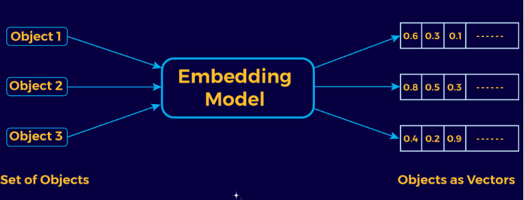

# **Procesamiento del Lenguaje Natural (PLN)**

## **Introducción**

El Procesamiento del Lenguaje Natural (Natural Languaje Processing, NLP) es un área de la Inteligencia Artificial (IA) relacionada con el procesamiento, análisis y comprensión de cualquier lenguaje natural con el objetivo de crear sistemas basados en IA que sean capaces de interactuar con seres humanos en el mismo lenguaje de manera escrita o hablada.

El PLN se encuentra en la zona intermedia entre la lingüística y la IA.

Un sistema de PLN puede actuar en tres escenarios diferentes:

1. Sistemas en los que el texto es la entrada (input) del sistema.
2. Sistemas en los que el texto es la salida (output) del sistema.
3. Sistemas en los que el texto es tanto la entrada como la salida.

## **Áreas de aplicación del PLN**

Las áreas del PLN son:

**NLP:** Procesamiento del Lenguaje Natural.

**NLU:** Entendimiento del Lenguaje Natural.

**NLG:** Generación del Lenguaje Natural.

## **Aplicaciones del PLN**

- Recuperación de información (Information Retrieval)
- Extracción de información (Information Extraction)
- QA, Respuestas a preguntas (Question Answering)
- Clasificación textual (Text Clasification)
- NLG, generación de lenguaje natural (Natural Languaje Generation)

## **Conceptos importantes**

### **Unidades de comunicación básica**

Desde el punto de vista computacional, en vez de trabajar con palabras, se trabaja con el concepto de **token**.
Un token es una secuencia de caracteres separados por espacio en blanco. 

La **tokenización** sirve como base para varias tareas de NLP, como la clasificación de texto, el análisis de sentimientos y el reconocimiento de entidades con nombre. Consiste en dividir el texto unidades más pequeñas llamadas tokens.

Todos los tokens de un texto que sean iguales se considera que pertenecen al mismo *type* o tipo. Si en un texto aparece, por ejemplo, cinco veces la palabra amigo, se dice que son cinco tokens del type amigo.

Ejemplo: Es amigo de mi amigo

**Types**: es amigo de mi (cuatro types)

**Tokens**: es amigo de mi amigo (cinco tokens)

El **lema** es la forma de nombrar una palabra y todas sus derivaciones morfológicas. En el caso de los verbos, el lema suele ser la forma de infinitivo y en el caso de los nombres, la forma de masculino singular. Si por ejemplo aparece en un texto *types* como "cantaría", "cantábamos", "cantaré", etc. Se dice que todos sus tokens pertenecen al lema "cantar". A este proceso se le llama **lematización**.

El **stemming** consiste en reducir cada token a su raiz o lexema: la parte invariable que asume el significado de la palabra. Si tengo la palabra caminando, elimian "ando" y deja "camin".

### **Vectores**

Los **vectores** son representaciones numéricas de texto, es decir es la forma en que traducimos el texto a un formato que un modelo de aprendizaje automático puede entender y aprender.

El objetivo es tener representaciones vectoriales útiles.

[Proyector de embeddings](https://projector.tensorflow.org/)

### **Stop Words**

Son palabras que no dan mucho significado a la oración (y, el, es, ...). Aparecen muchas veces en todas las oraciones pero no aportan mucha información.

Si ignoramos estas stop words, los vectores van a tener menos dimensiones y se va a poder trabajar mejor.

### **Corpus**

Un **corpus lingüístico** es un conjunto de textos relativamente grande, que refleja una lengua. Es decir, es un conjunto amplio y estructurado de ejemplos reales de uso de la lengua.

Encontrar un buen corpus sobre el cual trabajar no suele ser una tarea sencilla; uno que se suele utilizar para entrenar modelos es la información de wikipedia.

### **Bolsa de palabras**

**Bag of Words (BoW)** es una técnica de PLN que busca representar documentos como vectores numéricos. Es un modelo de representación que se basa en la definición de un vector de longitud constante donde se reflejan las ocurrencias de cada uno de los términos existentes a lo largo de las unidades que forma parte del corpus (párrafo, documento, conjunto de documentos). 

Es una técnica que surgió en el año 1954. Describe toda la información que hay en cada una de las frases. 
Se representa mediante una tabla donde se marca el número de veces que una palabra aparece en cada uno de los documentos.

!!! note "Importante"
    No considera la estructura gramatical ni el orden de las palabras.

Esta técnica no considera el orden de las palabras aunque es bastante importante. Por ejemplo, no significaría lo mismo "la casa de María " que "la María de casa".

Se puede utilizar la bolsa de trabajo por ejemplo, para el análisis de sentimientos, donde nos interesaría saber si el sentimiento es positivo o negativo. También se puede utilizar en la detección de spam, ya que solamente tendría que buscar parlabras del tipo: premio, ganador, etc. para saber si ese correo es spam o no. En el caso de CHATGPT, no podríamos utilizarlo ya que sí que es importante el orden que tienen las palabras.

Una de las técnicas que se utilizan en la bolsa de palabras para convertir el texto en vector es el **conteo de palabras** que consisten en lo siguiente:

1. Determinar el tamaño del vocabulario, es contar las palabras únicas que aparecen en los documentos.
2. Creamos un vector basado en el tamaño del vocabulario. Cada posición representa una palabra en el vocabulario.
3. Eliminación de las palabras más frecuentes. Se eliminan las stopwords así como palabras comunes a todos los documentos.

Con esto, ya podemos sacar una primera conclusión, el documento uno es un sentimiento positivo de las películas. El documento dos un sentimiento negativo y el tres negativo.

Construcción de un BoW:

1. Construcción del vocabulario. Se tiene que preprocesar el documento con anterioridad.
2. Vectorizar los documentos. Crear un vector donde cada posición representa una palabra en el vocabulario.
3. Eliminamos las palabras más frecuentes. No solo las stopwords sino también palabras que se repiten mucho y no aportan información.
4. Vectorización de documentos con el documento totalmente preprocesado.
5. Normalización de las frecuencias. Si comparamos documentos de diferentes tamaños, tenemos que dividir la frecuencia de cada palabra entre la longitud total del documento en el que se encuentra.

Cuando ya tenemos construido el BOW, tendremos una matriz donde cada fila representa un documento y cada columna una palabra del vocabulario y los valores de la matriz, son la frecuencia de dicha palabra en dicho documento.

### **Modelos n-gramas**

Los modelos **n-gramas** son modelos estadísticos para predecir la siguiente palabra dada una secuencia de elementos lingüísticos.
Un n-grama es una secuencia de n elementos como pueden ser palabras, letras, etc.

Ejemplo: "La vida es bella"

    1-grama: "la","vida","es","bella"

    2-grama: "la vida", "vida es", "es bella"

    3-grama: "la vida es","vida es bella"
    
    ...

Cuantos más n-gramas tengamos, más información tendremos sobre el contexto.

Los modelos de n-gramas funcionan de la siguiente manera:

- Los modelos se construyen calculando la frecuencia de cada n-grama en el conjunto de datos.
- Basándonos en dichas frecuencias, se calculan las probabilidades.

Por ejemplo si digo "la vida es ", habrá más probabilidades de que a continuación vaya la palabra "bella" que la palabra "fea".

Estos modelos se utilizan en la predicción de texto, generación de texto, transcripción de voz a texto, clasificación de texto.

## Actividad 1.1

!!! note "Actividad 1.1"
    Crea un notebook dividido en dos partes:

    - BoW

      1. Descarga un libro.

      2. Realiza el preprocesamiento.

      3. Justifica el tema del libro.

    - N-grama

      1. Realiza la práctica anterior con 2-grama y 4-grama.

      2. Conclusiones.

<!--
## **Similitud de vectores**

## **Método TF-IDF**

El método **Term Frequency (TF) e Inverse Document Frequency (IDF)** significa la frecuencia del término y la frecuencia inversa del documento. Este método indica cómo de importante es una palabra en un documento.
Tenemos que tener en cuenta que no todas las palabras comunes son **stop words** ya que por ejemplo la palabra "no" puede ser una palabra clave en el análisis de sentimientos entonces no tendríamos que considerarla como stop word.

TF-IDF asigna una puntuación a cada palabra en función de su frecuencia en ese documento (TF) y su frecuencia en todos los documentos (IDF). Cuanto más a menudo aparece una palabra en un solo documento, pero menos veces aparece en todos los documentos, mayor va a ser su puntuación, es decir, las palabras que aparecen con más frecuencia en un documento pero raramente en otros documentos son más importantes.

Para calcular estos valores:

- **TF-IDF**: se multiplica TF por IDF.
- **TF**: es el número de veces que aparece una palabra en un documento dividido por el total de palabras de ese documento.
- **IDF**: es el logaritmo del total de documentos dividido por el número de documentos que contiene la palabra.

## **Word embedding**

Es la representación del texto en forma de vector.

Son vectores que nos permiten representar palabras, ver su significado y la relación con otras palabras. Una de las técnicas más populares que se utiliza es **Word2Vec** que utiliza dos arquitecturas de redes neuronales que son Bag of Words (CBOW) y Skip-Gram. Las dos técnicas utilizan una red neuronal para predecir el contexto de una palabra o predecir una palabra dado un contexto. La diferencia de las dos técnicas es la siguiente:

- Bag of Words (CBOW): Se toma un conjunto de palabras de contexto y se quiere predecir la palabra objetivo, es decir, la palabra que probablemente aparecerá. Por ejemplo cuando estamos escribiendo en el móvil y nos aparece la palabra que posiblemente queremos escribir.
- Skip-Gram: Coge una palabra objetivo y trata de predecir las palabras del contexto.

Word2Vec es un método iterativo que realiza los siguientes pasos:

- Utiliza un gran corpus de texto.
- Repasa toto el texto con una ventana deslizante, moviendo una palabra a la vez. En cada paso hay una palabra central y palabras de contexto.
- Para la palabra central, calcula las probabilidades de las palabras de contexto.
- Ajusta los vectores para aumentar estas probabilidades.
-->