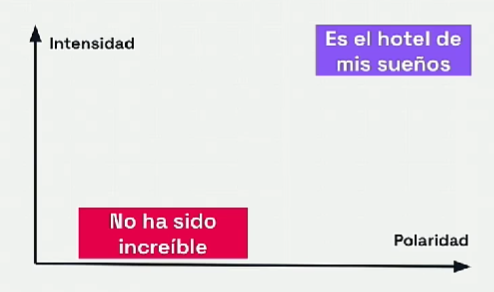

# **Análisis de Sentimiento**


En el análisis de sentimientos se puede interpretar, analizar y categorizar las opiniones y emociones humanas expresadas en forma de texto.

Categorización: positivo, negativo, neutral.

Podemos considerar el análisis de sentimiento como una tarea de **clasificación** etiquetando las entradas como positivas y negativas por ejemplo.
Otra posibilidad es tratar el análisis de sentimiento como una tarea de **regresión**, es decir predecir un valor continuo en vez de una categoría.

El análisis de sentimiento tiene en cuenta dos variables:

- **Polaridad:** es un comentario positivo o negativo.

- **Intensidad:** diferentes grados de la polaridad.




## **Aplicaciones del análisis de sentimiento**

- Redes sociales: analiza los comentarios en tiempo real para ver reacciones de la gente o reputación. 

- Reseñas de productos o servicios.

- Encuestas en línea: para comprender mejor las preferencias de los clientes.

- Decisiones de inversión.

## **Métodos para el análisis de sentimiento**

Una manera básica y sencilla es la detección de palabras clave como bueno, malo, pésimo,... pero no comprende el contexto.

El método con Aprendizaje automático, basado en técnicas de IA, construye un modelo que aprende a través de miles de ejemplos a distinguir entre un comentario positivo y otro negativo.

Descargamos el módulo para reseñas en español

```python
! pip install sentiment-analysis-spanish
```
Cargamos el modelo en memoria y lo almacenamos en la variable model_sentiment
```python
from sentiment_analysis_spanish import sentiment_analysis
model_sentiment = sentiment_analysis.SentimentAnalysisSpanish()
```
Definimos una función que tiene como entrada el texto y el modelo y nos devuelve el sentimiento.

```python
def sentimiento(texto, sentiment=model_sentiment):
  return sentiment.sentiment(texto)
```
Aplicamos nuestro modelo sobre por ejemplo los títulos de mi dataset titulos_sentimiento
```python
titulos_sentimiento["prediccion_ia"] = titulos_sentimiento["title"].apply(lambda texto: sentimiento(texto))
```
Ajusto las predicciones para quitar los decimales y que me aparezcan únicamente dos valores
```python
def ajusto_predicciones_ia(prediccion):
  if prediccion < 0.5:
    return 0
  else:
    return 3
```

