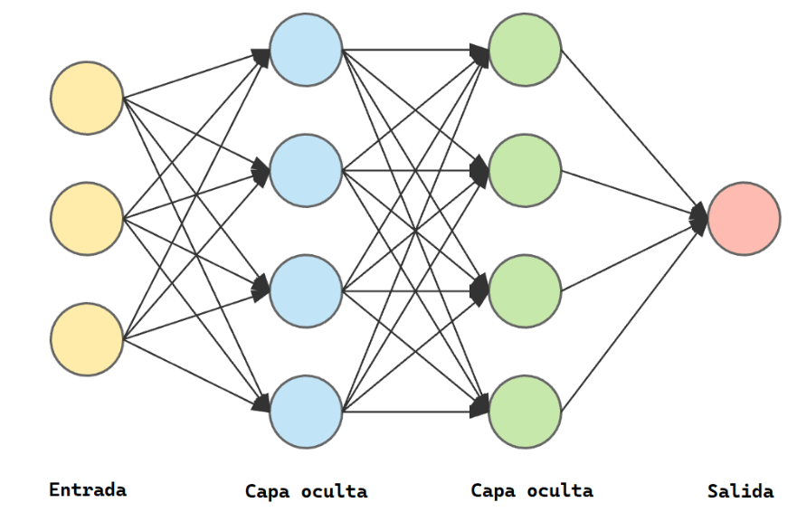
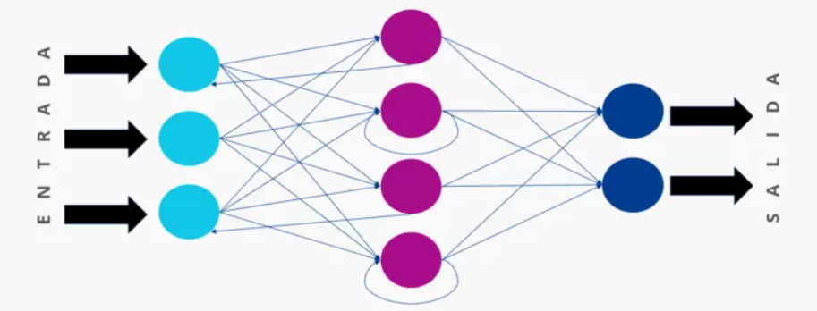

# **PLN con Redes neuronales**

Las redes neuronales son una estructura de neuronas interconectaddas entre sí que procesan datos de manera similar al cerebro humano.

La composición de las redes neuronales es la siguiente:

- Capa de entrada: recibe los datos iniciales.

- Capas ocultas: Procesan la información en base a las salidas de la capa anterior y generan representaciones intermedias.

- Capa de salida: genera la predicción o resultado final. Requiere tantas neuronas como salidas necesitemos.





### **Redes Neuronales Recurrentes (RNR)**

Las Redes Neuronales Recurrentes son un tipo de arquitectura diseñada para manejar datos con formato de **secuencia** como textos, audios o series temporales.

Estas redes permiten mantener una especie de "memoria" de las entradas anteriores mientras se procesan las entradas actuales.

Una red recurrente es capaz de procesar varias palabras a la vez y por tanto entender mejor el contexto de cada palabra.



Algunos tipos de Redes Neuronales Recurrentes:

- **RNN estándar:** También conocida como RNN de bucle simple, es la forma más básica de RNN. Tiene conexiones de retroalimentación que permiten que la salida de una capa se retroalimente como entrada en la siguiente iteración de tiempo.

- **LSTM (Long Short-Term Memory):** Las LSTM son una variante de las RNN diseñada para abordar el problema del desvanecimiento del gradiente y capturar dependencias a largo plazo de manera más efectiva. Introducen unidades de memoria que permiten a la red aprender qué información retener y qué olvidar a lo largo del tiempo.

```python
from tensorflow.keras.layers import LSTM
red.add(LSTM(128))
```

- **GRU (Gated Recurrent Unit):** Similar a las LSTM, las GRU son otra variante de las RNN que también abordan el problema del desvanecimiento del gradiente. Tienen una estructura más simple que las LSTM, con menos parámetros, lo que puede llevar a un entrenamiento más rápido y eficiente en algunos casos.

```python
from tensorflow.keras.layers import GRU
red.add(GRU(128)
```
```python
# Importar las bibliotecas necesarias
import numpy as np
from tensorflow.keras.datasets import imdb
from tensorflow.keras.preprocessing.sequence import pad_sequences
from tensorflow.keras.models import Sequential
from tensorflow.keras.layers import Dense, Embedding, SimpleRNN

# Definir los parámetros
max_features = 10000  # Número máximo de palabras a considerar como características
maxlen = 100  # Truncar secuencias después de este número de pasos de tiempo
batch_size = 32

# Cargar los datos
(x_train, y_train), (x_test, y_test) = imdb.load_data(num_words=max_features)

# Preprocesar los datos
x_train = pad_sequences(x_train, maxlen=maxlen)
x_test = pad_sequences(x_test, maxlen=maxlen)

# Construir el modelo
model = Sequential()
model.add(Embedding(max_features, 32))
model.add(SimpleRNN(32))
model.add(Dense(1, activation='sigmoid'))

# Compilar el modelo
model.compile(optimizer='rmsprop', loss='binary_crossentropy', metrics=['acc'])

# Entrenar el modelo
history = model.fit(x_train, y_train, epochs=10, batch_size=batch_size, validation_split=0.2)

# Evaluar el modelo
test_loss, test_acc = model.evaluate(x_test, y_test)
print('Test accuracy:', test_acc)

```


### **Redes Neuronales Convolucionales**

La **convolución** es una operación matemática que se utiliza para extraer características importantes de los datos. Se utiliza mucho en el tratamiento de imágenes.

Las CNN están formadas por tres tipos principales de capas:

- **Capa convolucional:** Es la primera capa de una red convolucional. Realiza la mayoría de los cálculos y se encarga de identificar características locales. 

- **capa de activación:** añaden funciones no lineales para permitir la aproximación de funciones más complejas.

- **Capa de agrupación (pooling):** Reduce la dimensionalidad de los datos y extrae características más complejas.

- **Capa totalmente conectada:** La última capa que procesa la información y produce la salida final.

A medida que los datos de la imagen avanzan a través de estas capas, la CNN reconoce elementos o formas más grandes, hasta identificar el objeto deseado.

En el PLN se utilizan estas redes para aprender características locales y globales del texto.

```python
from tensorflow.keras.models import Sequential
from tensorflow.keras.layers import Dense, Embedding, Conv1D, GlobalMaxPooling1D
```
Construimos la red de forma secuencial

```python
red = Sequential()
```
Añadimos la capa de embedding

```python
red.add(Embedding(tamano_vocabulario, 128))
```
Añadimos una capa de convoluciones con 64 filtros convolucionales de tamaño 5.
```python
red.add(Conv1D(64, 5, activation='relu'))
```
Reducimos la dimensionalidad con pooling

```python
red.add(GlobalMaxPooling1D())
```
Añadimos una capa densa de 32 neuronas para procesar las representaciones obtenidas.

```python
red.add(Dense(32))
```
Por último haremos que nuestra red termine en una única neurona con una función de activación sigmoidal que hará que los resultados estén próximos a los extremos, es decir, a 0 o a 1. Al final lo que queremos es que la red nos clasifique las reseñas como positivas o negativas

```python
red.add(Dense(1, activation='sigmoid'))
```
Le indicamos el optimizador que debe usar para reducir la pérdida y el tipo de métrica
```python
red.compile(optimizer='adam', loss='binary_crossentropy', metrics=['accuracy'])
```
Entrenamos el modelo

```python
red.fit(x_train, y_train, batch_size=32, epochs=5, validation_data=(x_test, y_test))
```
Evaluamos el modelo

```python
loss, accuracy = red.evaluate(x_test, y_test)
print(f'Tasa de acierto: {accuracy}')
```
