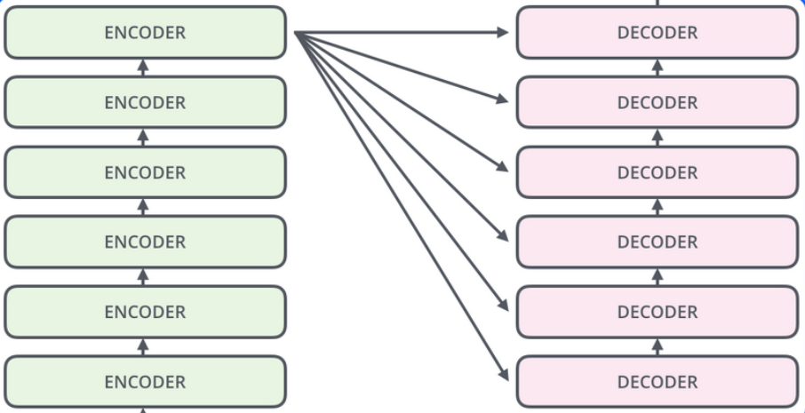
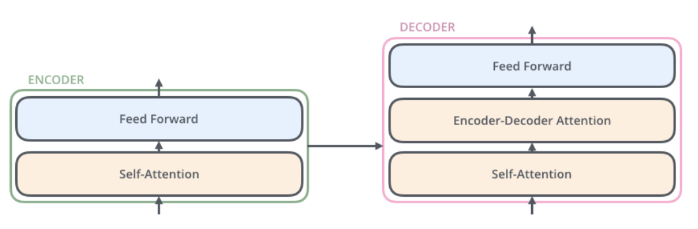

# **TRANSFORMERS**

Es un tipo de arquitectura basada en redes neuronales que procesan secuencias de palabras y tienen memoria a largo plazo, es decir que logran analizar secuencias muy extensas usando un mecanismo que se llama **atención**. Además, procesan toda la secuencia en paralelo (las redes recurrentes lo hacen en serie).

Las redes transformers están descritas en el artículo del 2017 llamado "Attention is All You Need".

En lugar de tratar todas las palabras de manera uniforme, los mecanismos de atención asignen pesos diferentes a cada palabra de entrada, de forma que las palabras relevantes acaben obteniendo más peso.

Un **transformer** es un tipo de red neuronal que se basa exclusivamente en mecanismos de atención para procesar datos de secuencia como textos, imágenes o series temporales.

Realmente el **ENCODERS** es un conjunto de encoders, uno encima de otro. Lo mismo sucede con el **DECODERS**.

La estructura de los encoders y los decoders es la siguiente:

<!--
## **PRE-ENTRENAMIENTO**

El pre-entrenamiento generativo proporciona al modelo un conjunto de datos formador por tokens y los entrena para predecir los tokens que contiene.

Hay dos formas de pre-entrenamiento:

* Predicción de la siguiente palabra.
* El modelo de lenguaje enmascarado.

### **Predicción de la siguiente palabra**

Es una técnica de aprendizaje supervisado que entrena el modelo con los datos de entrada y su correspondiente salida. Permite entrenar el modelo para predecir la siguiente palabra en una oración dado el contexto de las palabras anteriores.

El modelo aprende a generar texto coherente conociendo las dependencias entre palabras en un contexto más ámplio. Cuantos más ejemplos se ven, mejor se predice la siguiente palabra.

### **El modelo de lenguaje enmascarado**

El modelo de lenguaje enmascarado entrena un modelo para predecir una palabra que está oculta en una oración.

Durante el entrenamiento, el modelo recibe como entrada tanto el texto original como el enmascarado.

-->
## **Introducción a los transformers**

Los transformers forman parte del pre-entrenamiento y potencian las técnicas que ya conocemos.

**" Attention Is All You Need "**

La arquitectura de los transformers da importancia a las relaciones entre palabras que no están cerca para generar un texto preciso y coherente.

Los componentes de la arquitectura transformers es la siguiente:

* Preprocesamiento.
* Codificación posicional (Posicional Encoding).
* Codificadores (Encoders).
* Decodificadores (Decoders).

## **Hugging Face**

La biblioteca "Transformers" de Hugging Face ofrece una variedad de modelos de lenguaje preentrenados basados en la arquitectura transformer. Algunos de los modelos más populares incluyen BERT, DistilBERT y RoBERTa.

BERT, que significa "Bidirectional Encoder Representations from Transformers", fue uno de los primeros modelos en aplicar la arquitectura transformer a tareas de PLN. Ofrece variantes como BERT base y BERT large, que difieren en el tamaño y la capacidad de procesamiento.

DistilBERT es una versión más liviana de BERT que conserva gran parte de su rendimiento y eficacia, pero con menos parámetros y un menor tiempo de entrenamiento. Esta versión es perfecta para aplicaciones donde se requiere una buena relación entre eficiencia y precisión.

RoBERTa, una versión mejorada de BERT, utiliza técnicas de entrenamiento adicionales para mejorar aún más el rendimiento en tareas de PLN. Al igual que BERT, también está disponible en versiones base y large.

Estos modelos de lenguaje ofrecen beneficios significativos para una variedad de tareas de PLN, como la clasificación de secuencias, la generación de texto y el análisis de sentimientos. 

## **Repaso de transformers**

- La arquitectura de Transformers utiliza Encoders y Decoders.
- El Transformer permite entrenar en paralelo y aprovechar la GPU.
- Utiliza un mecanismo de atención que cruza en memoria “todos contra todos los tokens” y obtiene un score. Los modelos anteriores como LSTM no podían memorizar textos largos ni correr en paralelo.
- El mecanismo de atención puede ser de Self Attention en el Encoder, Cross Attention ó Masked Attention en el Decoder. 
- Se utiliza El Input pero también la Salida (el Output del dataset) para entrenar al modelo.
