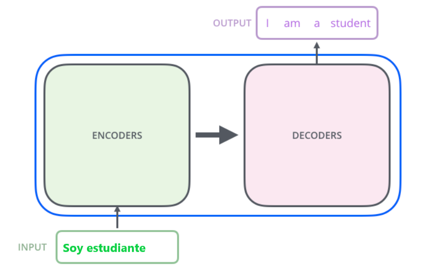

# **TRANSFER LEARNING**

las técnicas de Aprendizaje Transferible (Transfer Learning) y el y Ajuste Fino (Fine Tuning) se presentan como innovaciones clave para la mejora de los modelos de Inteligencia Artificial.

TL consiste en aprovechar los conocimientos adquiridos por un modelo entrenado para una determinada tarea para mejorar el rendimiento en otra tarea diferente, es decir que en lugar de entrenar un modelo desde cero para cada tarea, se transfieren los conocimientos previos de otro modelo con el fin de reducir la cantidad de datos necesarios para entrenar.

TL implica congelar los pesos del modelo previamente entrenado y solo entrenar las nuevas capas, el fine tuning va un paso más allá al permitir que se actualicen las capas previamente entrenadas.

 

# **FINE-TUNING**

El ajuste fino se utiliza para:

- Dominio del lenguaje: Aprende terminología técnica o legal muy específica que no estaba en el pre-entrenamiento (Ej: que conteste en un formato más formal si estamos en un entorno de abogacía).
- Formato y estructura: forzar al modelo a responder siempre en un JSON específico, o con un tono académico extremadamente riguroso.
- Restricciones de comportamiento: enseñar al modelo a ser extremadamente precavido y a decir "No lo sé" con mayor frecuencia.

Ciclo de vida del modelo:

- **Pre-training (Pre-entrenamiento)**: El modelo aprende a predecir el siguiente token a partir de una cantidad masiva de datos. Aquí adquiere "conocimiento del mundo" y gramática, pero no sabe seguir instrucciones. Es un completador de frases.
- **SFT (Supervised Fine-Tuning)**: Es el proceso de entrenar al modelo en un dataset más pequeño y curado de pares Instrucción -> Respuesta. Aquí es donde el modelo aprende el formato de chat y a obedecer órdenes.
- **Alignment (Alineación - RLHF/DPO)**: Se ajusta el modelo para que sus respuestas sean seguras, útiles y honestas, basándose en preferencias humanas.

## **PEFT: Parameter-Efficient Fine-Tuning**

Es un tipo de Fine Tuning. Entrenar un modelo grande desde cero o incluso hacer un fine-tuning completo es extremadamente costoso. Por ejemplo, un modelo de 9.000 millones de parámetros (9B) requeriría actualizar 9.000 millones de números en cada paso, lo que implica cientos de gigabytes de VRAM y hardware muy especializado. PEFT surge como la solución: permite adaptar modelos gigantes a tareas específicas sin necesidad de actualizar todos sus parámetros, reduciendo enormemente recursos y tiempo de entrenamiento.
**LoRA (Low-Rank Adaptation)**
LoRA es la técnica más utilizada dentro de PEFT y se basa en la idea de que para adaptar un modelo a una tarea concreta no es necesario modificar todos sus parámetros, sino que los ajustes importantes pueden representarse mediante matrices mucho más pequeñas y sencillas, ocupando un espacio reducido dentro de la red. Modifica capas más pequeñas, congela la matriz principal y añade dos matrices nuevas mediante una serie de operaciones.

**Cómo funciona**:En lugar de modificar la matriz de pesos original 𝑊, que es enorme, LoRA la congela y añade dos matrices pequeñas, 𝐴y 𝐵, que sí se entrenan. La actualización final del modelo se calcula como: 
𝑊_𝑓𝑖𝑛𝑎𝑙=𝑊+(𝐴×𝐵)
Esto significa que solo entrenamos un pequeño subconjunto de parámetros, manteniendo intacta la base del modelo.
**Ventajas de LoRA**:
Reduce hasta un 99% los parámetros que se deben entrenar.
Disminuye drásticamente el consumo de memoria durante el entrenamiento.
Los adaptadores resultantes son muy ligeros, lo que facilita su almacenamiento y distribución.

**QLoRA: Cuantización + LoRA**

QLoRA lleva la eficiencia aún más lejos, combinando cuantización con LoRA y otras optimizaciones de memoria. Sus principales innovaciones son:
- **4-bit NormalFloat (NF4)**: Comprime los pesos del modelo original a solo 4 bits, manteniendo casi toda la precisión (la precisión en el modelo).
- **Double Quantization**: Comprime también las constantes de cuantización, reduciendo aún más el tamaño (Ej.: float32 a float16).
- **Paged Optimizers**: Gestiona los picos de memoria usando la RAM del sistema cuando la VRAM se llena, evitando errores de “Out of Memory”.

Resultado: Gracias a QLoRA, es posible entrenar modelos de 9B o incluso 13B en una sola GPU de consumo, como una RTX 3090 o 4090, haciendo que el fine-tuning avanzado sea accesible para laboratorios pequeños y desarrolladores individuales.

## **Hiperparámetros Críticos en el Entrenamiento**

Para que el fine-tuning funcione de manera eficiente, es necesario ajustar cuidadosamente varios parámetros clave, como si estuviéramos regulando los “pomos” de un motor complejo. Cada uno afecta tanto a la calidad del aprendizaje como al uso de memoria y tiempo de entrenamiento.
- **Rank (r)**: Determina el tamaño de las matrices 𝑨 y 𝑩 en LoRA. Valores típicos: 8, 16 o 32. Un r más alto permite que el modelo capture patrones más complejos, pero también aumenta el consumo de memoria y tiempo de entrenamiento.
- **LoRA Alpha (𝛼)**: Factor de escala que multiplica los ajustes aprendidos por 𝐴×𝐵. Normalmente se fija en el doble del Rank (por ejemplo, si 𝑟=16, 𝛼=32). Controla la intensidad de las actualizaciones sin desestabilizar el modelo. Le da el peso final dentro de la matriz original. 
- **Learning Rate (Tasa de aprendizaje)**: Indica la velocidad a la que el modelo ajusta sus parámetros. En SFT suele ser mucho más baja que en el preentrenamiento completo (ej. 2×10^(−4)). Si es demasiado alta, el modelo puede sufrir Catastrophic Forgetting (olvido catastrófico), es decir, olvidar conocimientos previos.
- **Epochs (Épocas)**: Número de veces que el modelo ve todo el dataset. En SFT, 1–3 épocas suelen ser suficientes; más allá de eso se produce overfitting, donde el modelo memoriza ejemplos en lugar de aprender a generalizar. 
  
Ajustar estos hiperparámetros correctamente permite que el modelo aprenda de manera estable y eficiente, sin desperdiciar recursos ni perder habilidades previas.

## **Evaluación del Entrenamiento**

Medir la mejora de un modelo no se limita a mirar cifras. Es un proceso que combina métricas cuantitativas y cualitativas.
- **Train/Eval Loss**: La curva de pérdida debería descender durante el entrenamiento. Si la pérdida de validación sube mientras la de entrenamiento baja, indica overfitting.
- **Catastrophic Forgetting**: Es crucial comprobar que el modelo no ha perdido habilidades básicas. Por ejemplo, después de entrenarlo debe seguir sabiendo sumar, responder saludos o escribir texto general. Tenemos una batería de preguntas que pasamos antes y después para comprobar que no ha desaprendido.
- **Benchmark Cualitativo**: Comparar respuestas del modelo base y del modelo fine-tuneado ante preguntas diseñadas para evaluar comprensión, coherencia y exactitud. Esto incluye preguntas “trampa” o ejemplos de edge cases, que permiten ver si el modelo realmente aprendió a razonar y no solo a memorizar.
  
Estas evaluaciones garantizan que el modelo no solo reproduce los ejemplos de entrenamiento, sino que generaliza correctamente a nuevas situaciones.

## **Ventajas del TL**

- Reducción de costes de entrenamiento.
- Mejora del rendimiento con pocos datos.
- Mejoras en la generalización.

## **Modelos GPT**

Los modelos GPT (Transformers Generativos Preentrenados) son importantes por su capacidad para capturar relaciones entre secuencias de datos. Se preentrenan de manera no supervisada sobre grandes cantidades de datos y una vez preentrenados, estos modelos se toman como base para el desarrollo de distintas tareas.

Una de las aplicaciones más conocidas es ChatGPT que utiliza Transfer Learning.

### **Fases de los modelos GPT**

- **Preentrenamiento**: El modelo se preentrena poniendo como tarea predecir la siguiente palabra en una secuencia de texto dada una secuencdia de palabras anteriores. De esta manera, va aprendiendo cómo se relacionan las palabras entre ellas tanto de forma semántica como de forma sintáctica.

- **Ajuste de parámetros**: Cuando el modelo ya ha aprendido sobre grandes cantidades de datos, se hace un último ajuste para adaptarlo a una tarea concreta.

### **Adaptación de los modelos**

1. Selección de modelo base adecuado. (ejm: el idioma).
2. Entrenamiento específico con datos relevantes. 
3. Ajuste de hiperparámetros (para optimizar resultados).
4. Evaluación adecuada del modelo (métricas adecuadas).
5. Transferencia de conocimiento gradual.

## **Herramientas preentrenadas**

Hay diferentes herramientas y módulos de Python que ofrencen funcionalidades relacionadas con el PLN. Estas herramientas parten de modelos que ya están entrenados y nos permite poder utilizarlas en otras tareas.

**GENSIN** es una biblioteca de python que realiza tareas como la extracción de temas en grandes volúmenes de texto, cálculo de siilitud de documentos o generación de resúmenes.

**SUMY** también es una biblioteca de python que implementa varios algoritmos para generar resúmenes de textos. Dispone de algoritmos ya entrenados para esta tarea como LexRank, TextRank o LSA.

**BART** es un modelo de lenguaje avanzado de Hugging Face que genera texto, traduce, corrige de forma automática y convierte texto a voz y viceversa.

**BERTSUM** creado a partir de BERT y entrenado específicamente mediante transfer learning para la generación automática de resúmenes.

**TEXTTEASER** es una herramienta de pytnon para la generación automática de resúmenes.

**KEYBERT** implementado por Hugging Face para la realización de tareas de resumen y extracción de palabras clave.

