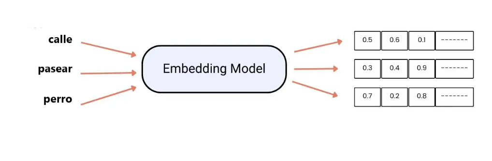

# **LLMs: Large Language Models**

Los grandes modelos lingüísticos (LLMs) son un subconjunto de PLN que generan respuestas textuales similares a las humanas.

**Large**:
    - Datos de entrenamiento y recursos.
**Language**:
    - Procesamiento y análisis de datos del lenguaje humano.
**Models**:
    - Aprende patrones complejos utilizando datos.

La finalidad de los embeddings es que las máquinas comprendan el significado de las palabras de manera efectiva. Son principalmente útiles para tareas como el análisis de sentimientos o la traducción automática.

## **Características de los embeddings**

* Captura semántica y sintáctica. Aprende el significado de la palabra y las relaciones sintácticas que tiene.
* Permite la transmisión de conocimiento, es decir se puede entrenar en wikipedia y usarse para cualquier tarea.
* Contextualidad. Permite variar el significado de la palabra según el contexto. Ejemplo: banco.
* Resuelve analogías. Por ejemplo: Madrid es a España como París es a ...
* Las palabras pertenecientes a un mismo campo semántico se encuentran próximas entre ellas.

## **Crear embeddings**

* Partimos de un conjunto de documentos sobre los que vamos a aprender. Ejemplo: Wikipedia
* Utilizamos modelos de IA para comprender el significado de las palabras.
* En principio utilizamos números aleatorios para crear los vectores.
* A medida que el modelo recorre distintos textos, va ajustando estos números para que reflejen las relaciones que existen en el texto.

## **Problemas para entrenar embeddings**

1. Requiere cantidad grandes de datos (wikipedia, libros, etc).
2. Necesita tecnologías costosas como GPU's.
3. Utilizan mucho tiempo en el entrenamiento (dias, semanas,...).
4. El ajuste de parámetros requiere múltiples iteraciones que conlleva costes en tiempo y recursos.

## **Embeddings entrenados**

Vistos los problemas que puede generar entrenar los embeddings desde cero, la mejor solución es utilizar embeddings que ya estén entrenados para realizar nuevas tareas. 

Los más utilizados son BERT, MUSE y GPT.

### **BERT**

**BERT** (Representaciones de Codificadores Bidireccional de Transformadores) fue desarrollado por Google en 2018. Se entrenó sobre un corpus compuesto por noticias, libros y artículos de distinto ámbito.
Utiliza el "mecanismo de atención" que permite entender las palabras y las relaciones entre ellas según el contexto.

### **MUSE**

**MUSE** (Embeddings supervisados y no supervisados multilingües) es un embedding en el que se comparten palabras de distintos idiomas. Creado por Facebook en 2018.

### **GPT**

Los modelos GPT han supuesto una verdadera revolución.**GPT** (Generativos, Preentrenados, Transformers). La última versión que tenemos es GPT4 que ha sido entrenado con un conjunto de datos muy grande.

GPT es capaz de detectar mayores matices del lenguaje, además de interactuar con interfaces externas para realizar tareas más complejas. 

