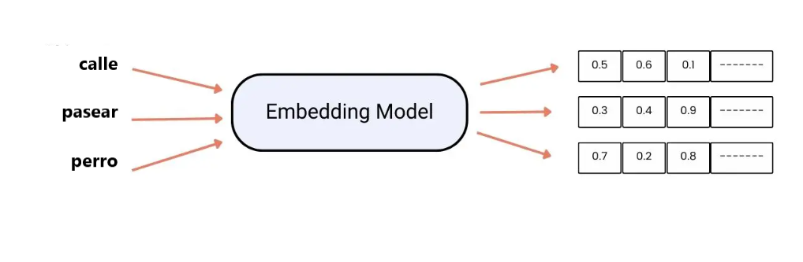

# **RAG**

Los LLMs funcionan como gigantescos repositorios de patrones lingüísticos, pero su conocimiento no es infinito ni siempre actualizado. Podemos distinguir dos tipos de memoria que condicionan lo que saben y cómo responden:
- Memoria Paramétrica: Corresponde a todo lo que el modelo aprendió durante el pre-entrenamiento. Está codificada en los pesos de la red neuronal, lo que significa que es estática y solo refleja información disponible hasta una fecha determinada (knowledge cutoff). No puede aprender hechos nuevos sin un reentrenamiento completo o un ajuste fino (fine-tuning).
- Memoria No Paramétrica: Representa cualquier información externa que se le proporcione al modelo al momento de la consulta. Puede ser un documento, una base de datos, o cualquier fuente actualizada, y permite al modelo acceder a conocimiento más allá de su entrenamiento inicial.
  
RAG (Generación Aumentada por Recuperación) es la arquitectura que combina estas memorias de manera eficiente. En lugar de depender únicamente de lo que "recuerda" el modelo, RAG permite que consulte una biblioteca de documentos relevantes antes de generar la respuesta. El modelo primero identifica los fragmentos más útiles (retrieval) y luego los utiliza para construir una respuesta contextualizada y precisa (generation).

**Ventajas de RAG frente al Fine-tuning para datos factuales**

Actualización inmediata: Si la legislación, una normativa o cualquier dato cambia, basta con actualizar los documentos en la base de datos; no hace falta reentrenar el modelo, lo que ahorra tiempo y recursos.
Trazabilidad: Como la respuesta se genera a partir de fuentes concretas, se pueden citar referencias precisas, por ejemplo: "Según el Artículo 14 del PDF X...". Esto aporta transparencia y confianza.
Reducción de alucinaciones: Al forzar al modelo a basarse en un contexto externo validado, se minimiza la generación de información inventada o errónea, algo frecuente en modelos que solo usan su memoria paramétrica.
En resumen, RAG convierte a los modelos de lenguaje en sistemas híbridos: mantienen la fluidez y creatividad de los LLMs, pero con la capacidad de acceder a información externa actualizada, confiable y trazable, superando los límites de la memoria paramétrica tradicional.

## **El Pipeline de Ingesta: Preparando el Conocimiento**

Antes de que un sistema RAG pueda responder preguntas de manera precisa, los datos deben prepararse cuidadosamente. La efectividad del modelo depende en gran medida de cómo se procesan, limpian y estructuran los documentos. Se trata de transformar información bruta en un formato que el modelo pueda comprender y consultar de forma eficiente.
Extracción de Texto
No todos los documentos son fáciles de procesar. Los PDFs, como los del BOE, presentan desafíos particulares:
- Columnas múltiples: El texto puede leerse en un orden distinto al visual, lo que confunde al modelo si no se corrige.
- Tablas: Contienen información importante, pero difícil de interpretar si se extrae como texto plano.
- Encabezados y pies de página: Suelen repetirse en cada página y pueden “ensuciar” el contexto si se incluyen tal cual.
- Metadatos ocultos: Información no visible que puede generar ruido en el procesamiento automático.
La extracción correcta consiste en limpiar el contenido, eliminar redundancias y estructurarlo de forma coherente.

**Estrategias de Chunking (Fragmentación)**

Los LLMs tienen una ventana de contexto limitada, por lo que no se puede enviar un documento completo de cientos de páginas de una sola vez. La solución es dividirlo en chunks o fragmentos manejables:
- Fixed-size Chunking: Fragmenta el texto cada X caracteres o palabras. Es rápido, pero puede cortar frases o ideas a la mitad.
- Recursive Character Chunking: Divide primero por párrafos, luego por frases y finalmente por palabras, preservando la unidad semántica y evitando cortes abruptos.
- Overlap (Solape): Mantener un pequeño porcentaje del fragmento anterior (10-20%) en el siguiente garantiza que el contexto no se pierda entre los cortes y que las relaciones entre fragmentos se mantengan.
  
Esta etapa asegura que cada fragmento contenga suficiente información relevante para que el modelo pueda comprenderlo de manera autónoma.

**Embeddings: La Representación Semántica**

Cada chunk se transforma en un vector numérico mediante un modelo de embeddings, como all-MiniLM-L6-v2.
Estos vectores representan el significado del texto en un espacio semántico, donde frases con ideas similares quedan próximas, aunque no compartan palabras exactas. Por ejemplo, “vacaciones retribuidas” y “descanso pagado” generan embeddings cercanos.
Gracias a esta representación, el modelo puede recuperar los fragmentos más relevantes de la base de datos según la consulta, incluso si las palabras exactas no coinciden.

En conjunto, la extracción, fragmentación y vectorización permiten que un sistema RAG funcione de manera rápida, precisa y confiable, sentando las bases para la recuperación y generación de respuestas basadas en documentos reales.

Nooooo

La finalidad de los embeddings es que las máquinas comprendan el significado de las palabras de manera efectiva. Son principalmente útiles para tareas como el análisis de sentimientos o la traducción automática.

## **Características de los embeddings**

* Captura semántica y sintáctica. Aprende el significado de la palabra y las relaciones sintácticas que tiene.
* Permite la transmisión de conocimiento, es decir se puede entrenar en wikipedia y usarse para cualquier tarea.
* Contextualidad. Permite variar el significado de la palabra según el contexto. Ejemplo: banco.
* Resuelve analogías. Por ejemplo: Madrid es a España como París es a ...
* Las palabras pertenecientes a un mismo campo semántico se encuentran próximas entre ellas.

## **Crear embeddings**

* Partimos de un conjunto de documentos sobre los que vamos a aprender. Ejemplo: Wikipedia
* Utilizamos modelos de IA para comprender el significado de las palabras.
* En principio utilizamos números aleatorios para crear los vectores.
* A medida que el modelo recorre distintos textos, va ajustando estos números para que reflejen las relaciones que existen en el texto.

## **Problemas para entrenar embeddings**

1. Requiere cantidad grandes de datos (wikipedia, libros, etc).
2. Necesita tecnologías costosas como GPU's.
3. Utilizan mucho tiempo en el entrenamiento (dias, semanas,...).
4. El ajuste de parámetros requiere múltiples iteraciones que conlleva costes en tiempo y recursos.

## **Embeddings entrenados**

Vistos los problemas que puede generar entrenar los embeddings desde cero, la mejor solución es utilizar embeddings que ya estén entrenados para realizar nuevas tareas. 

Los más utilizados son BERT, MUSE y GPT.

### **BERT**

**BERT** (Representaciones de Codificadores Bidireccional de Transformadores) fue desarrollado por Google en 2018. Se entrenó sobre un corpus compuesto por noticias, libros y artículos de distinto ámbito.
Utiliza el "mecanismo de atención" que permite entender las palabras y las relaciones entre ellas según el contexto.

### **MUSE**

**MUSE** (Embeddings supervisados y no supervisados multilingües) es un embedding en el que se comparten palabras de distintos idiomas. Creado por Facebook en 2018.

### **GPT**

Los modelos GPT han supuesto una verdadera revolución.**GPT** (Generativos, Preentrenados, Transformers). La última versión que tenemos es GPT4 que ha sido entrenado con un conjunto de datos muy grande.

GPT es capaz de detectar mayores matices del lenguaje, además de interactuar con interfaces externas para realizar tareas más complejas. 

